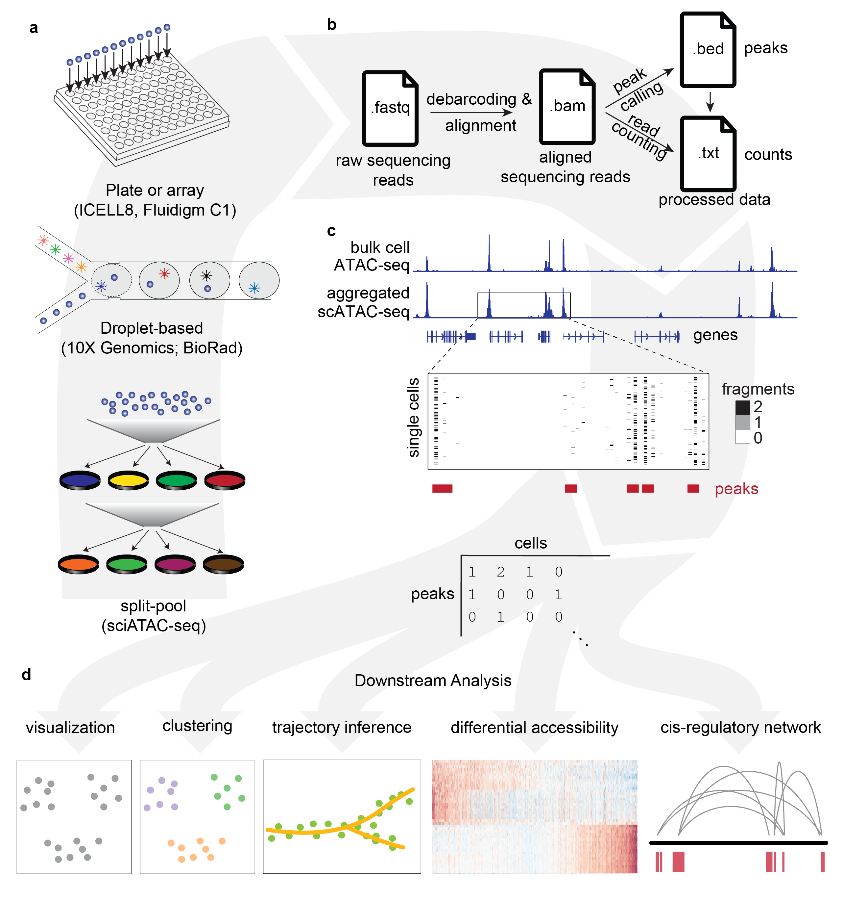
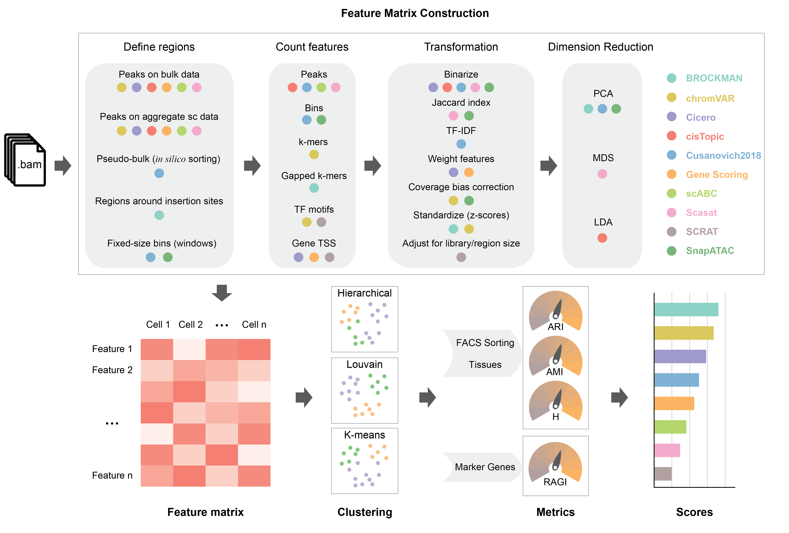
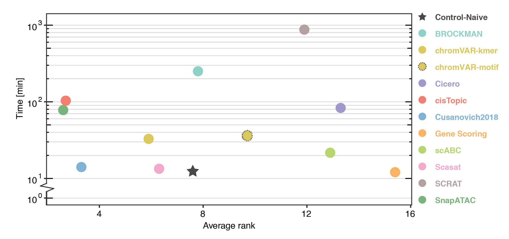

# scATAC-benchmarking

Recent innovations in single-cell Assay for Transposase Accessible Chromatin using sequencing (scATAC-seq) enable profiling of the epigenetic landscape of thousands of individual cells. scATAC-seq data analysis presents unique methodological challenges. scATAC-seq experiments sample DNA, which, due to low copy numbers (diploid in humans) lead to inherent data sparsity (1-10% of peaks detected per cell) compared to transcriptomic (scRNA-seq) data (10-45% of expressed genes detected per cell). Such challenges in data generation emphasize the need for informative features to assess cell heterogeneity at the chromatin level.  

We present a benchmarking framework that was applied to 10 computational methods for scATAC-seq on 13 synthetic and real datasets from different assays, profiling cell types from diverse tissues and organisms. Methods for processing and featurizing scATAC-seq data were evaluated by their ability to discriminate cell types when combined with common unsupervised clustering approaches. We rank evaluated methods and discuss computational challenges associated with scATAC-seq analysis including inherently sparse data, determination of features, peak calling, the effects of sequencing coverage and noise, and clustering performance. Running times and memory requirements are also discussed. 

Single Cell ATAC-seq Benchmarking Framework
-------------------------------------------

Our benchmarking results highlight SnapATAC, cisTopic, and Cusanovich2018 as the top performing scATAC-seq data analysis methods to perform clustering across all datasets and different metrics. Methods that preserve information at the peak-level (cisTopic, Cusanovich2018, Scasat) or bin-level (SnapATAC) generally outperform those that summarize accessible chromatin regions at the motif/k-mer level (chromVAR, BROCKMAN, SCRAT) or over the gene-body (Cicero, Gene Scoring). In addition, methods that implement a dimensionality reduction step (BROCKMAN, cisTopic, Cusanovich2018, Scasat, SnapATAC) generally show advantages over the other methods without this important step. SnapATAC is the most scalable method; it was the only method capable of processing more than 80,000 cells. Cusanovich2018 is the method that best balances analysis performance and running time. 

All the analyses performed are illustrated in Jupyter Notebooks. 

Within each dataset folder, the folder **'output'** stores all the output files and it consists of five sub-folders including **'feature_matrices'**, **'umap_rds'**, **'clusters'**, **'metrics'**, and **'figures'**.

### Real Data

- The _**Buenrostro2018**_ dataset (folder **'Buenrostro_2018'**)

  - [input](https://github.com/pinellolab/scATAC-benchmarking/tree/master/Real_Data/Buenrostro_2018/input)
  - run_methods
    - [BROCKMAN](https://nbviewer.jupyter.org/github/pinellolab/scATAC-benchmarking/blob/master/Real_Data/Buenrostro_2018/run_methods/BROCKMAN/BROCKMAN_buenrostro2018.ipynb?flush_cache=true)
    - [chromVAR-kmers](https://nbviewer.jupyter.org/github/pinellolab/scATAC-benchmarking/blob/master/Real_Data/Buenrostro_2018/run_methods/chromVAR/chromVAR_buenrostro2018_kmers.ipynb?flush_cache=true)
    - [chromVAR-motifs](https://nbviewer.jupyter.org/github/pinellolab/scATAC-benchmarking/blob/master/Real_Data/Buenrostro_2018/run_methods/chromVAR/chromVAR_buenrostro2018_motifs.ipynb?flush_cache=true)
    - [Cicero](https://nbviewer.jupyter.org/github/pinellolab/scATAC-benchmarking/blob/master/Real_Data/Buenrostro_2018/run_methods/Cicero/Cicero_buenrostro2018.ipynb?flush_cache=true)
    - [cisTopic](https://nbviewer.jupyter.org/github/pinellolab/scATAC-benchmarking/blob/master/Real_Data/Buenrostro_2018/run_methods/cisTopic/cisTopic_buenrostro2018.ipynb?flush_cache=true)
    - [Control](https://nbviewer.jupyter.org/github/pinellolab/scATAC-benchmarking/blob/master/Real_Data/Buenrostro_2018/run_methods/Control/Control_buenrostro2018.ipynb?flush_cache=true)
    - [Cusanovich2018](https://nbviewer.jupyter.org/github/pinellolab/scATAC-benchmarking/blob/master/Real_Data/Buenrostro_2018/run_methods/Cusanovich2018/Cusanovich2018_buenrostro2018.ipynb?flush_cache=true)
    - [GeneScoring](https://nbviewer.jupyter.org/github/pinellolab/scATAC-benchmarking/blob/master/Real_Data/Buenrostro_2018/run_methods/GeneScoring/GeneScoring_buenrostro2018.ipynb?flush_cache=true)
    - [scABC](https://nbviewer.jupyter.org/github/pinellolab/scATAC-benchmarking/blob/master/Real_Data/Buenrostro_2018/run_methods/scABC/scABC_buenrostro2018.ipynb?flush_cache=true)
    - [Scasat](https://nbviewer.jupyter.org/github/pinellolab/scATAC-benchmarking/blob/master/Real_Data/Buenrostro_2018/run_methods/Scasat/Scasat_buenrostro2018.ipynb?flush_cache=true)
    - [SCRAT](https://nbviewer.jupyter.org/github/pinellolab/scATAC-benchmarking/blob/master/Real_Data/Buenrostro_2018/run_methods/SCRAT/SCRAT_buenrostro2018.ipynb?flush_cache=true)
    - [SnapATAC](https://nbviewer.jupyter.org/github/pinellolab/scATAC-benchmarking/blob/master/Real_Data/Buenrostro_2018/run_methods/SnapATAC/SnapATAC_buenrostro2018.ipynb?flush_cache=true)
  - [clustering evaluation](https://nbviewer.jupyter.org/github/pinellolab/scATAC-benchmarking/blob/master/Real_Data/Buenrostro_2018/run_clustering_buenrostro2018.ipynb?flush_cache=true)
  - [UMAP visualization](https://nbviewer.jupyter.org/github/pinellolab/scATAC-benchmarking/blob/master/Real_Data/Buenrostro_2018/run_umap_buenrostro2018.ipynb?flush_cache=true)
  - end-to-end clustering (folder 'extra_clustering')
    - [Cicero](https://nbviewer.jupyter.org/github/pinellolab/scATAC-benchmarking/blob/master/Real_Data/Buenrostro_2018/extra_clustering/Cicero/Cicero_buenrostro2018.ipynb?flush_cache=true)
    - [cisTopic](https://nbviewer.jupyter.org/github/pinellolab/scATAC-benchmarking/blob/master/Real_Data/Buenrostro_2018/extra_clustering/cisTopic/cisTopic_buenrostro2018.ipynb?flush_cache=true)
    - [Cusanovich2018](https://nbviewer.jupyter.org/github/pinellolab/scATAC-benchmarking/blob/master/Real_Data/Buenrostro_2018/extra_clustering/Cusanovich2018/Cusanovich2018_buenrostro2018.ipynb?flush_cache=true)
    - [scABC](https://nbviewer.jupyter.org/github/pinellolab/scATAC-benchmarking/blob/master/Real_Data/Buenrostro_2018/extra_clustering/scABC/scABC_buenrostro2018.ipynb?flush_cache=true)
    - [Scasat](https://nbviewer.jupyter.org/github/pinellolab/scATAC-benchmarking/blob/master/Real_Data/Buenrostro_2018/extra_clustering/Scasat/Scasat_buenrostro2018.ipynb?flush_cache=true)
    - [SnapATAC](https://nbviewer.jupyter.org/github/pinellolab/scATAC-benchmarking/blob/master/Real_Data/Buenrostro_2018/extra_clustering/SnapATAC/SnapATAC_buenrostro2018.ipynb?flush_cache=true)
  - [end-to-end clustering evaluation](https://nbviewer.jupyter.org/github/pinellolab/scATAC-benchmarking/blob/master/Real_Data/Buenrostro_2018/extra_clustering/run_metrics_buenrostro2018.ipynb?flush_cache=true)
  - output

- The _**Buenrostro2018 using bulk peaks**_ dataset (folder **'Buenrostro_2018_bulkpeaks'**)
  - [input](https://github.com/pinellolab/scATAC-benchmarking/tree/master/Real_Data/Buenrostro_2018_bulkpeaks/input)
  - run_methods
    - [chromVAR-kmers](https://nbviewer.jupyter.org/github/pinellolab/scATAC-benchmarking/blob/master/Real_Data/Buenrostro_2018_bulkpeaks/run_methods/chromVAR/chromVAR_buenrostro2018bulkpeaks_kmers.ipynb?flush_cache=true)
    - [chromVAR-motifs](https://nbviewer.jupyter.org/github/pinellolab/scATAC-benchmarking/blob/master/Real_Data/Buenrostro_2018_bulkpeaks/run_methods/chromVAR/chromVAR_buenrostro2018bulkpeaks_motifs.ipynb?flush_cache=true)
    - [Cicero](https://nbviewer.jupyter.org/github/pinellolab/scATAC-benchmarking/blob/master/Real_Data/Buenrostro_2018_bulkpeaks/run_methods/Cicero/Cicero_buenrostro2018bulkpeaks.ipynb?flush_cache=true)
    - [cisTopic](https://nbviewer.jupyter.org/github/pinellolab/scATAC-benchmarking/blob/master/Real_Data/Buenrostro_2018_bulkpeaks/run_methods/cisTopic/cisTopic_buenrostro2018bulkpeaks.ipynb?flush_cache=true)
    - [Control](https://nbviewer.jupyter.org/github/pinellolab/scATAC-benchmarking/blob/master/Real_Data/Buenrostro_2018_bulkpeaks/run_methods/Control/Control_buenrostro2018bulkpeaks.ipynb?flush_cache=true)
    - [Cusanovich2018](https://nbviewer.jupyter.org/github/pinellolab/scATAC-benchmarking/blob/master/Real_Data/Buenrostro_2018_bulkpeaks/run_methods/Cusanovich2018/Cusanovich2018_buenrostro2018bulkpeaks.ipynb?flush_cache=true)
    - [GeneScoring](https://nbviewer.jupyter.org/github/pinellolab/scATAC-benchmarking/blob/master/Real_Data/Buenrostro_2018_bulkpeaks/run_methods/GeneScoring/GeneScoring_buenrostro2018bulkpeaks.ipynb?flush_cache=true)
    - [scABC](https://nbviewer.jupyter.org/github/pinellolab/scATAC-benchmarking/blob/master/Real_Data/Buenrostro_2018_bulkpeaks/run_methods/scABC/scABC_buenrostro2018bulkpeaks.ipynb?flush_cache=true)
    - [Scasat](https://nbviewer.jupyter.org/github/pinellolab/scATAC-benchmarking/blob/master/Real_Data/Buenrostro_2018_bulkpeaks/run_methods/Scasat/Scasat_buenrostro2018bulkpeaks.ipynb?flush_cache=true)
  - [clustering evaluation](https://nbviewer.jupyter.org/github/pinellolab/scATAC-benchmarking/blob/master/Real_Data/Buenrostro_2018_bulkpeaks/run_clustering_buenrostro2018bulkpeaks.ipynb?flush_cache=true)
  - [UMAP visualization](https://nbviewer.jupyter.org/github/pinellolab/scATAC-benchmarking/blob/master/Real_Data/Buenrostro_2018_bulkpeaks/run_umap_buenrostro2018bulkpeaks.ipynb?flush_cache=true)
  - output

- The _**10X PBMCs**_ dataset (folder **'10x_PBMC_5k'**)
  - [input](https://github.com/pinellolab/scATAC-benchmarking/tree/master/Real_Data/10x_PBMC_5k/input)
  - run_methods
    - [BROCKMAN](https://nbviewer.jupyter.org/github/pinellolab/scATAC-benchmarking/blob/master/Real_Data/10x_PBMC_5k/run_methods/BROCKMAN/BROCKMAN_10xpbmc5k.ipynb?flush_cache=true)
    - [chromVAR-kmers](https://nbviewer.jupyter.org/github/pinellolab/scATAC-benchmarking/blob/master/Real_Data/10x_PBMC_5k/run_methods/chromVAR/chromVAR_10xpbmc5k_kmers.ipynb?flush_cache=true)
    - [chromVAR-motifs](https://nbviewer.jupyter.org/github/pinellolab/scATAC-benchmarking/blob/master/Real_Data/10x_PBMC_5k/run_methods/chromVAR/chromVAR_10xpbmc5k_motifs.ipynb?flush_cache=true)
    - [Cicero](https://nbviewer.jupyter.org/github/pinellolab/scATAC-benchmarking/blob/master/Real_Data/10x_PBMC_5k/run_methods/Cicero/Cicero_10xpbmc5k.ipynb?flush_cache=true)
    - [cisTopic](https://nbviewer.jupyter.org/github/pinellolab/scATAC-benchmarking/blob/master/Real_Data/10x_PBMC_5k/run_methods/cisTopic/cisTopic_10xpbmc5k.ipynb?flush_cache=true)
    - [Control](https://nbviewer.jupyter.org/github/pinellolab/scATAC-benchmarking/blob/master/Real_Data/10x_PBMC_5k/run_methods/Control/Control_10xpbmc5k.ipynb?flush_cache=true)
    - [Cusanovich2018](https://nbviewer.jupyter.org/github/pinellolab/scATAC-benchmarking/blob/master/Real_Data/10x_PBMC_5k/run_methods/Cusanovich2018/Cusanovich2018_10xpbmc5k.ipynb?flush_cache=true)
    - [GeneScoring](https://nbviewer.jupyter.org/github/pinellolab/scATAC-benchmarking/blob/master/Real_Data/10x_PBMC_5k/run_methods/GeneScoring/GeneScoring_10xpbmc5k.ipynb?flush_cache=true)
    - [scABC](https://nbviewer.jupyter.org/github/pinellolab/scATAC-benchmarking/blob/master/Real_Data/10x_PBMC_5k/run_methods/scABC/scABC_10xpbmc5k.ipynb?flush_cache=true)
    - [Scasat](https://nbviewer.jupyter.org/github/pinellolab/scATAC-benchmarking/blob/master/Real_Data/10x_PBMC_5k/run_methods/Scasat/Scasat_10xpbmc5k.ipynb?flush_cache=true)
    - [SCRAT](https://nbviewer.jupyter.org/github/pinellolab/scATAC-benchmarking/blob/master/Real_Data/10x_PBMC_5k/run_methods/SCRAT/SCRAT_10xpbmc5k.ipynb?flush_cache=true)
    - [SnapATAC](https://nbviewer.jupyter.org/github/pinellolab/scATAC-benchmarking/blob/master/Real_Data/10x_PBMC_5k/run_methods/SnapATAC/SnapATAC_10xpbmc5k.ipynb?flush_cache=true)
  - [clustering evaluation](https://nbviewer.jupyter.org/github/pinellolab/scATAC-benchmarking/blob/master/Real_Data/10x_PBMC_5k/run_clustering_10xpbmc5k.ipynb?flush_cache=true)
  - [UMAP visualization](https://nbviewer.jupyter.org/github/pinellolab/scATAC-benchmarking/blob/master/Real_Data/10x_PBMC_5k/run_umap_10xpbmc5k.ipynb?flush_cache=true)
  - end-to-end clustering (folder 'extra_clustering')
    - [Cicero](https://nbviewer.jupyter.org/github/pinellolab/scATAC-benchmarking/blob/master/Real_Data/10x_PBMC_5k/extra_clustering/Cicero/Cicero_10xpbmc5k.ipynb?flush_cache=true)
    - [cisTopic](https://nbviewer.jupyter.org/github/pinellolab/scATAC-benchmarking/blob/master/Real_Data/10x_PBMC_5k/extra_clustering/cisTopic/cisTopic_10xpbmc5k.ipynb?flush_cache=true)
    - [Cusanovich2018](https://nbviewer.jupyter.org/github/pinellolab/scATAC-benchmarking/blob/master/Real_Data/Buenrostro_2018/extra_clustering/Cusanovich2018/Cusanovich2018_10xpbmc5k.ipynb?flush_cache=true)
    - [scABC](https://nbviewer.jupyter.org/github/pinellolab/scATAC-benchmarking/blob/master/Real_Data/Buenrostro_2018/extra_clustering/scABC/scABC_10xpbmc5k.ipynb?flush_cache=true)
    - [Scasat](https://nbviewer.jupyter.org/github/pinellolab/scATAC-benchmarking/blob/master/Real_Data/Buenrostro_2018/extra_clustering/Scasat/Scasat_10xpbmc5k.ipynb?flush_cache=true)
    - [SnapATAC](https://nbviewer.jupyter.org/github/pinellolab/scATAC-benchmarking/blob/master/Real_Data/Buenrostro_2018/extra_clustering/SnapATAC/SnapATAC_10xpbmc5k.ipynb?flush_cache=true)
  - [end-to-end clustering evaluation](https://nbviewer.jupyter.org/github/pinellolab/scATAC-benchmarking/blob/master/Real_Data/10x_PBMC_5k/extra_clustering/run_metrics_10xpbmc.ipynb?flush_cache=true)
  - output

- The _**downsampled sci-ATAC-seq-mouse**_ dataset (folder **'Cusanovich_2018_subset'**)
  - [input](https://github.com/pinellolab/scATAC-benchmarking/tree/master/Real_Data/Cusanovich_2018_subset/input)
  - run_methods
    - [BROCKMAN](https://nbviewer.jupyter.org/github/pinellolab/scATAC-benchmarking/blob/master/Real_Data/Cusanovich_2018_subset/run_methods/BROCKMAN/BROCKMAN_cusanovich2018subset.ipynb?flush_cache=true)
    - [chromVAR-kmers](https://nbviewer.jupyter.org/github/pinellolab/scATAC-benchmarking/blob/master/Real_Data/Cusanovich_2018_subset/run_methods/chromVAR/chromVAR_cusanovich2018subset_kmers.ipynb?flush_cache=true)
    - [chromVAR-motifs](https://nbviewer.jupyter.org/github/pinellolab/scATAC-benchmarking/blob/master/Real_Data/Cusanovich_2018_subset/run_methods/chromVAR/chromVAR_cusanovich2018subset_motifs.ipynb?flush_cache=true)
    - [Cicero](https://nbviewer.jupyter.org/github/pinellolab/scATAC-benchmarking/blob/master/Real_Data/Cusanovich_2018_subset/run_methods/Cicero/Cicero_cusanovich2018subset.ipynb?flush_cache=true)
    - [cisTopic](https://nbviewer.jupyter.org/github/pinellolab/scATAC-benchmarking/blob/master/Real_Data/Cusanovich_2018_subset/run_methods/cisTopic/cisTopic_cusanovich2018subset.ipynb?flush_cache=true)
    - [Control](https://nbviewer.jupyter.org/github/pinellolab/scATAC-benchmarking/blob/master/Real_Data/Cusanovich_2018_subset/run_methods/Control/Control_cusanovich2018subset.ipynb?flush_cache=true)
    - [Cusanovich2018](https://nbviewer.jupyter.org/github/pinellolab/scATAC-benchmarking/blob/master/Real_Data/Cusanovich_2018_subset/run_methods/Cusanovich2018/Cusanovich2018_cusanovich2018subset.ipynb?flush_cache=true)
    - [GeneScoring](https://nbviewer.jupyter.org/github/pinellolab/scATAC-benchmarking/blob/master/Real_Data/Cusanovich_2018_subset/run_methods/GeneScoring/GeneScoring_cusanovich2018subset.ipynb?flush_cache=true)
    - [scABC](https://nbviewer.jupyter.org/github/pinellolab/scATAC-benchmarking/blob/master/Real_Data/Cusanovich_2018_subset/run_methods/scABC/scABC_cusanovich2018subset.ipynb?flush_cache=true)
    - [Scasat](https://nbviewer.jupyter.org/github/pinellolab/scATAC-benchmarking/blob/master/Real_Data/Cusanovich_2018_subset/run_methods/Scasat/Scasat_cusanovich2018subset.ipynb?flush_cache=true)
    - [SCRAT](https://nbviewer.jupyter.org/github/pinellolab/scATAC-benchmarking/blob/master/Real_Data/Cusanovich_2018_subset/run_methods/SCRAT/SCRAT_cusanovich2018subset.ipynb?flush_cache=true)
    - [SnapATAC](https://nbviewer.jupyter.org/github/pinellolab/scATAC-benchmarking/blob/master/Real_Data/Cusanovich_2018_subset/run_methods/SnapATAC/SnapATAC_cusanovich2018subset.ipynb?flush_cache=true)
  - [clustering evaluation](https://nbviewer.jupyter.org/github/pinellolab/scATAC-benchmarking/blob/master/Real_Data/Cusanovich_2018_subset/run_clustering_cusanovich2018subset.ipynb?flush_cache=true)
  - [UMAP visualization](https://nbviewer.jupyter.org/github/pinellolab/scATAC-benchmarking/blob/master/Real_Data/Cusanovich_2018_subset/run_umap_cusanovich2018subset.ipynb?flush_cache=true)
  - end-to-end clustering (folder 'extra_clustering')
    - [Cicero](https://nbviewer.jupyter.org/github/pinellolab/scATAC-benchmarking/blob/master/Real_Data/Cusanovich_2018_subset/extra_clustering/Cicero/Cicero_cusanovich2018subset.ipynb?flush_cache=true)
    - [cisTopic](https://nbviewer.jupyter.org/github/pinellolab/scATAC-benchmarking/blob/master/Real_Data/Cusanovich_2018_subset/extra_clustering/cisTopic/cisTopic_cusanovich2018subset.ipynb?flush_cache=true)
    - [Cusanovich2018](https://nbviewer.jupyter.org/github/pinellolab/scATAC-benchmarking/blob/master/Real_Data/Cusanovich_2018_subset/extra_clustering/Cusanovich2018/Cusanovich2018_cusanovich2018subset.ipynb?flush_cache=true)
    - [scABC](https://nbviewer.jupyter.org/github/pinellolab/scATAC-benchmarking/blob/master/Real_Data/Cusanovich_2018_subset/extra_clustering/scABC/scABC_cusanovich2018subset.ipynb?flush_cache=true)
    - [Scasat](https://nbviewer.jupyter.org/github/pinellolab/scATAC-benchmarking/blob/master/Real_Data/Cusanovich_2018_subset/extra_clustering/Scasat/Scasat_cusanovich2018subset.ipynb?flush_cache=true)
    - [SnapATAC](https://nbviewer.jupyter.org/github/pinellolab/scATAC-benchmarking/blob/master/Real_Data/Cusanovich_2018_subset/extra_clustering/SnapATAC/SnapATAC_cusanovich2018subset.ipynb?flush_cache=true)
  - [end-to-end clustering evaluation](https://nbviewer.jupyter.org/github/pinellolab/scATAC-benchmarking/blob/master/Real_Data/Cusanovich_2018_subset/extra_clustering/run_metrics_cusanovich2018subset.ipynb?flush_cache=true)
  - output

- The _**full sci-ATAC-seq-mouse**_ dataset (folder **'Cusanovich_2018'**)
  - [input](https://github.com/pinellolab/scATAC-benchmarking/tree/master/Real_Data/Cusanovich_2018/input)
  - run_methods
    - [SnapATAC](https://nbviewer.jupyter.org/github/pinellolab/scATAC-benchmarking/blob/master/Real_Data/Cusanovich_2018/run_methods/SnapATAC/SnapATAC_cusanovich2018.ipynb?flush_cache=true)
  - [clustering evaluation](https://nbviewer.jupyter.org/github/pinellolab/scATAC-benchmarking/blob/master/Real_Data/Cusanovich_2018/run_clustering_cusanovich2018.ipynb?flush_cache=true)
  - [UMAP visualization](https://nbviewer.jupyter.org/github/pinellolab/scATAC-benchmarking/blob/master/Real_Data/Cusanovich_2018/run_umap_cusanovich2018.ipynb?flush_cache=true)
  - output

### Synthetic Data

- **Data Simulation** (folder **'Simulate_scATAC'**)
  - Bone Marrow
    - [varying noise levels](https://nbviewer.jupyter.org/github/pinellolab/scATAC-benchmarking/blob/master/Synthetic_Data/Simulate_scATAC/BoneMarrow/simulate_bonemarrow_noise.ipynb?flush_cache=true)
    - [varying coverages](https://nbviewer.jupyter.org/github/pinellolab/scATAC-benchmarking/blob/master/Synthetic_Data/Simulate_scATAC/BoneMarrow/simulate_bonemarrow_depth.ipynb?flush_cache=true)

  - Erythropoiesis
    - [varying noise levels](https://nbviewer.jupyter.org/github/pinellolab/scATAC-benchmarking/blob/master/Synthetic_Data/Simulate_scATAC/Erythropoiesis/simulate_erythropoesis.ipynb?flush_cache=true)

- The _**simulated bone marrow (noise level 0.0)**_ dataset (folder **'BoneMarrow_clean'**)
  - [input](https://github.com/pinellolab/scATAC-benchmarking/tree/master/Synthetic_Data/BoneMarrow_clean/input)
  - [run_methods](https://nbviewer.jupyter.org/github/pinellolab/scATAC-benchmarking/blob/master/Synthetic_Data/BoneMarrow_clean/run_methods/run_methods_bonemarrow_clean.ipynb?flush_cache=true)
  - [clustering evaluation](https://nbviewer.jupyter.org/github/pinellolab/scATAC-benchmarking/blob/master/Synthetic_Data/BoneMarrow_clean/run_clustering_bonemarrow_clean.ipynb?flush_cache=true)
  - [UMAP visualization](https://nbviewer.jupyter.org/github/pinellolab/scATAC-benchmarking/blob/master/Synthetic_Data/BoneMarrow_clean/run_plots_bonemarrow_clean.ipynb?flush_cache=true)
  - output

- The _**simulated bone marrow (noise level 0.2)**_ dataset (folder **'BoneMarrow_noisy_p2'**)
  - [input](https://github.com/pinellolab/scATAC-benchmarking/tree/master/Synthetic_Data/BoneMarrow_noisy_p2/input)
  - [run_methods](https://nbviewer.jupyter.org/github/pinellolab/scATAC-benchmarking/blob/master/Synthetic_Data/BoneMarrow_noisy_p2/run_methods/run_methods_bonemarrow_noisy_p2.ipynb?flush_cache=true)
  - [clustering evaluation](https://nbviewer.jupyter.org/github/pinellolab/scATAC-benchmarking/blob/master/Synthetic_Data/BoneMarrow_noisy_p2/run_clustering_bonemarrow_noisy_p2.ipynb?flush_cache=true)
  - [UMAP visualization](https://nbviewer.jupyter.org/github/pinellolab/scATAC-benchmarking/blob/master/Synthetic_Data/BoneMarrow_noisy_p2/run_plots_bonemarrow_noisy_p2.ipynb?flush_cache=true)
  - output

- The _**simulated bone marrow (noise level 0.4)**_ dataset (folder **'BoneMarrow_noisy_p4'**)
  - [input](https://github.com/pinellolab/scATAC-benchmarking/tree/master/Synthetic_Data/BoneMarrow_noisy_p4/input)
  - [run_methods](https://nbviewer.jupyter.org/github/pinellolab/scATAC-benchmarking/blob/master/Synthetic_Data/BoneMarrow_noisy_p4/run_methods/run_methods_bonemarrow_noisy_p4.ipynb?flush_cache=true)
  - [clustering evaluation](https://nbviewer.jupyter.org/github/pinellolab/scATAC-benchmarking/blob/master/Synthetic_Data/BoneMarrow_noisy_p4/run_clustering_bonemarrow_noisy_p4.ipynb?flush_cache=true)
  - [UMAP visualization](https://nbviewer.jupyter.org/github/pinellolab/scATAC-benchmarking/blob/master/Synthetic_Data/BoneMarrow_noisy_p4/run_plots_bonemarrow_noisy_p4.ipynb?flush_cache=true)
  - output

- The _**simulated bone marrow (coverage 5k reads)**_ dataset (folder **'BoneMarrow_cov5000'**)
  - [input](https://github.com/pinellolab/scATAC-benchmarking/tree/master/Synthetic_Data/BoneMarrow_cov5000/input)
  - [run_methods](https://nbviewer.jupyter.org/github/pinellolab/scATAC-benchmarking/blob/master/Synthetic_Data/BoneMarrow_cov5000/run_methods/run_methods_bonemarrow_cov5000.ipynb?flush_cache=true)
  - [clustering evaluation](https://nbviewer.jupyter.org/github/pinellolab/scATAC-benchmarking/blob/master/Synthetic_Data/BoneMarrow_cov5000/run_clustering_bonemarrow_cov5000.ipynb?flush_cache=true)
  - [UMAP visualization](https://nbviewer.jupyter.org/github/pinellolab/scATAC-benchmarking/blob/master/Synthetic_Data/BoneMarrow_cov5000/run_plots_bonemarrow_cov5000.ipynb?flush_cache=true)
  - output

- The _**simulated bone marrow (coverage 2.5k reads)**_ dataset (folder **'BoneMarrow_cov2500'**)
  - [input](https://github.com/pinellolab/scATAC-benchmarking/tree/master/Synthetic_Data/BoneMarrow_cov2500/input)
  - [run_methods](https://nbviewer.jupyter.org/github/pinellolab/scATAC-benchmarking/blob/master/Synthetic_Data/BoneMarrow_cov2500/run_methods/run_methods_bonemarrow_cov2500.ipynb?flush_cache=true)
  - [clustering evaluation](https://nbviewer.jupyter.org/github/pinellolab/scATAC-benchmarking/blob/master/Synthetic_Data/BoneMarrow_cov2500/run_clustering_bonemarrow_cov2500.ipynb?flush_cache=true)
  - [UMAP visualization](https://nbviewer.jupyter.org/github/pinellolab/scATAC-benchmarking/blob/master/Synthetic_Data/BoneMarrow_cov2500/run_plots_bonemarrow_cov2500.ipynb?flush_cache=true)
  - output

- The _**simulated bone marrow (coverage 1k reads)**_ dataset (folder **'BoneMarrow_cov1000'**)
  - [input](https://github.com/pinellolab/scATAC-benchmarking/tree/master/Synthetic_Data/BoneMarrow_cov1000/input)
  - [run_methods](https://nbviewer.jupyter.org/github/pinellolab/scATAC-benchmarking/blob/master/Synthetic_Data/BoneMarrow_cov1000/run_methods/run_methods_bonemarrow_cov1000.ipynb?flush_cache=true)
  - [clustering evaluation](https://nbviewer.jupyter.org/github/pinellolab/scATAC-benchmarking/blob/master/Synthetic_Data/BoneMarrow_cov1000/run_clustering_bonemarrow_cov1000.ipynb?flush_cache=true)
  - [UMAP visualization](https://nbviewer.jupyter.org/github/pinellolab/scATAC-benchmarking/blob/master/Synthetic_Data/BoneMarrow_cov1000/run_plots_bonemarrow_cov1000.ipynb?flush_cache=true)
  - output

- The _**simulated bone marrow (coverage 500 reads)**_ dataset (folder **'BoneMarrow_cov500'**)
  - [input](https://github.com/pinellolab/scATAC-benchmarking/tree/master/Synthetic_Data/BoneMarrow_cov500/input)
  - [run_methods](https://nbviewer.jupyter.org/github/pinellolab/scATAC-benchmarking/blob/master/Synthetic_Data/BoneMarrow_cov500/run_methods/run_methods_bonemarrow_cov500.ipynb?flush_cache=true)
  - [clustering evaluation](https://nbviewer.jupyter.org/github/pinellolab/scATAC-benchmarking/blob/master/Synthetic_Data/BoneMarrow_cov500/run_clustering_bonemarrow_cov500.ipynb?flush_cache=true)
  - [UMAP visualization](https://nbviewer.jupyter.org/github/pinellolab/scATAC-benchmarking/blob/master/Synthetic_Data/BoneMarrow_cov500/run_plots_bonemarrow_cov500.ipynb?flush_cache=true)
  - output

- The _**simulated bone marrow (coverage 250 reads)**_ dataset (folder **'BoneMarrow_cov250'**)
  - [input](https://github.com/pinellolab/scATAC-benchmarking/tree/master/Synthetic_Data/BoneMarrow_cov250/input)
  - [run_methods](https://nbviewer.jupyter.org/github/pinellolab/scATAC-benchmarking/blob/master/Synthetic_Data/BoneMarrow_cov250/run_methods/run_methods_bonemarrow_cov250.ipynb?flush_cache=true)
  - [clustering evaluation](https://nbviewer.jupyter.org/github/pinellolab/scATAC-benchmarking/blob/master/Synthetic_Data/BoneMarrow_cov250/run_clustering_bonemarrow_cov250.ipynb?flush_cache=true)
  - [UMAP visualization](https://nbviewer.jupyter.org/github/pinellolab/scATAC-benchmarking/blob/master/Synthetic_Data/BoneMarrow_cov250/run_plots_bonemarrow_cov250.ipynb?flush_cache=true)
  - output

- The _**simulated erythropoiesis (noise level 0.0)**_ dataset (folder **'Erythropoiesis_clean'**)
  - [input](https://github.com/pinellolab/scATAC-benchmarking/tree/master/Synthetic_Data/Erythropoiesis_clean/input)
  - [run_methods](https://nbviewer.jupyter.org/github/pinellolab/scATAC-benchmarking/blob/master/Synthetic_Data/Erythropoiesis_clean/run_methods/run_methods_erythropoesis_clean.ipynb?flush_cache=true)
  - [clustering evaluation](https://nbviewer.jupyter.org/github/pinellolab/scATAC-benchmarking/blob/master/Synthetic_Data/Erythropoiesis_clean/run_clustering_erythropoesis_clean.ipynb?flush_cache=true)
  - [UMAP visualization](https://nbviewer.jupyter.org/github/pinellolab/scATAC-benchmarking/blob/master/Synthetic_Data/Erythropoiesis_clean/run_plots_erythropoesis_clean.ipynb?flush_cache=true)
  - output

- The _**simulated erythropoiesis (noise level 0.2)**_ dataset (folder **'Erythropoiesis_noisy_p2'**)
  - [input](https://github.com/pinellolab/scATAC-benchmarking/tree/master/Synthetic_Data/Erythropoiesis_noisy_p2/input)
  - [run_methods](https://nbviewer.jupyter.org/github/pinellolab/scATAC-benchmarking/blob/master/Synthetic_Data/Erythropoiesis_noisy_p2/run_methods/run_methods_erythropoesis_noisy_p2.ipynb?flush_cache=true)
  - [clustering evaluation](https://nbviewer.jupyter.org/github/pinellolab/scATAC-benchmarking/blob/master/Synthetic_Data/Erythropoiesis_noisy_p2/run_clustering_erythropoesis_noisy_p2.ipynb?flush_cache=true)
  - [UMAP visualization](https://nbviewer.jupyter.org/github/pinellolab/scATAC-benchmarking/blob/master/Synthetic_Data/Erythropoiesis_noisy_p2/run_plots_erythropoesis_noisy_p2.ipynb?flush_cache=true)
  - output

- The _**simulated erythropoiesis (noise level 0.4)**_ dataset (folder **'Erythropoiesis_noisy_p4'**)
  - [input](https://github.com/pinellolab/scATAC-benchmarking/tree/master/Synthetic_Data/Erythropoiesis_noisy_p4/input)
  - [run_methods](https://nbviewer.jupyter.org/github/pinellolab/scATAC-benchmarking/blob/master/Synthetic_Data/Erythropoiesis_noisy_p4/run_methods/run_methods_erythropoesis_noisy_p4.ipynb?flush_cache=true)
  - [clustering evaluation](https://nbviewer.jupyter.org/github/pinellolab/scATAC-benchmarking/blob/master/Synthetic_Data/Erythropoiesis_noisy_p4/run_clustering_erythropoesis_noisy_p4.ipynb?flush_cache=true)
  - [UMAP visualization](https://nbviewer.jupyter.org/github/pinellolab/scATAC-benchmarking/blob/master/Synthetic_Data/Erythropoiesis_noisy_p4/run_plots_erythropoesis_noisy_p4.ipynb?flush_cache=true)
  - output

### Extra

- Test first PC
  - [on the *Buenrostro2018* dataset](https://nbviewer.jupyter.org/github/pinellolab/scATAC-benchmarking/blob/master/Extra/Buenrostro_2018/test_firstPC/test_firstPC_buenrostro2018.ipynb?flush_cache=true)
  - [on the *10X PBMCs* dataset](https://nbviewer.jupyter.org/github/pinellolab/scATAC-benchmarking/blob/master/Extra/10x_PBMC_5k/test_firstPC/test_firstPC_10xPBMC5k.ipynb?flush_cache=true)
  - [on the *downsampled sci-ATAC-seq-mouse* dataset](https://nbviewer.jupyter.org/github/pinellolab/scATAC-benchmarking/blob/master/Extra/Cusanovich_2018_subset/test_firstPC/test_firstPC_cusanovich2018subset.ipynb?flush_cache=true)

- Test peaks
  - frequency-based peak selection
    - [Control on the *Buenrostro2018* dataset](https://nbviewer.jupyter.org/github/pinellolab/scATAC-benchmarking/blob/master/Extra/Buenrostro_2018/test_peaks/Control/Control_peaks_frequency.ipynb?flush_cache=true)
    - [Control on the *simulated bone marrow (noise level 0.2)* dataset](https://nbviewer.jupyter.org/github/pinellolab/scATAC-benchmarking/blob/master/Extra/BoneMarrow_noisy_p2/test_peaks/Control/Control_peaks_frequency.ipynb?flush_cache=true)
    - [Cusanovich2018 on the *Buenrostro2018* dataset](https://nbviewer.jupyter.org/github/pinellolab/scATAC-benchmarking/blob/master/Extra/Buenrostro_2018/test_peaks/Cusanovich2018/Cusanovich2018_peaks_frequency.ipynb?flush_cache=true)
    - [Cusanovich2018 on the *simulated bone marrow (noise level 0.2)* dataset](https://nbviewer.jupyter.org/github/pinellolab/scATAC-benchmarking/blob/master/Extra/BoneMarrow_noisy_p2/test_peaks/Cusanovich2018/Cusanovich2018_peaks_frequency.ipynb?flush_cache=true)
  - intensity-based peak selection
    - [Control on the *Buenrostro2018* dataset](https://nbviewer.jupyter.org/github/pinellolab/scATAC-benchmarking/blob/master/Extra/Buenrostro_2018/test_peaks/Control/Control_peaks_intensity.ipynb?flush_cache=true)
    - [Control on the *simulated bone marrow (noise level 0.2)* dataset](https://nbviewer.jupyter.org/github/pinellolab/scATAC-benchmarking/blob/master/Extra/BoneMarrow_noisy_p2/test_peaks/Control/Control_peaks_intensity.ipynb?flush_cache=true)
    - [Cusanovich2018 on the *Buenrostro2018* dataset](https://nbviewer.jupyter.org/github/pinellolab/scATAC-benchmarking/blob/master/Extra/Buenrostro_2018/test_peaks/Cusanovich2018/Cusanovich2018_peaks_frequency.ipynb?flush_cache=true)
    - [Cusanovich2018 on the *simulated bone marrow (noise level 0.2)* dataset](https://nbviewer.jupyter.org/github/pinellolab/scATAC-benchmarking/blob/master/Extra/BoneMarrow_noisy_p2/test_peaks/Cusanovich2018/Cusanovich2018_peaks_frequency.ipynb?flush_cache=true)

- Test pseudo-bulk
  - [Cusanovich2018 on the *Buenrostro2018* dataset](https://nbviewer.jupyter.org/github/pinellolab/scATAC-benchmarking/blob/master/Extra/Buenrostro_2018/test_pseudobulk/Cusanovich2018_buenrostro2018_idenfify_clades.ipynb?flush_cache=true)
  - [Cusanovich2018 on the *10X PBMCs* dataset](https://nbviewer.jupyter.org/github/pinellolab/scATAC-benchmarking/blob/master/Extra/10x_PBMC_5k/test_pseudobulk/Cusanovich2018_10xpbmc5k_idenfify_clades.ipynb?flush_cache=true)
  - [Cusanovich2018 on the *downsampled sci-ATAC-seq-mouse* dataset](https://nbviewer.jupyter.org/github/pinellolab/scATAC-benchmarking/blob/master/Extra/Cusanovich_2018_subset/test_pseudobulk/Cusanovich2018_cusanovich2018subset_idenfify_clades.ipynb?flush_cache=true)

- Test blacklist
  - [SCRAT on the *Buenrostro2018* dataset](https://nbviewer.jupyter.org/github/pinellolab/scATAC-benchmarking/blob/master/Extra/Buenrostro_2018/test_blacklist/SCRAT_buenrostro2018-blacklist-rm.ipynb?flush_cache=true)
  - [SnapATAC on the *Buenrostro2018* dataset](https://nbviewer.jupyter.org/github/pinellolab/scATAC-benchmarking/blob/master/Extra/Buenrostro_2018/test_blacklist/SnapATAC_buenrostro2018-blacklist-rm.ipynb?flush_cache=true)
  - [SCRAT on the *10X PBMCs* dataset](https://nbviewer.jupyter.org/github/pinellolab/scATAC-benchmarking/blob/master/Extra/10x_PBMC_5k/test_blacklist/SCRAT_10xpbmc_5k_no_blacklist_filtering.ipynb?flush_cache=true)
  - [SnapATAC on the *10X PBMCs* dataset](https://nbviewer.jupyter.org/github/pinellolab/scATAC-benchmarking/blob/master/Extra/10x_PBMC_5k/test_blacklist/SnapATAC_10xpbmc_5k_no_blacklist_filtering.ipynb?flush_cache=true)
  - [SCRAT on the *downsampled sci-ATAC-seq-mouse* dataset](https://nbviewer.jupyter.org/github/pinellolab/scATAC-benchmarking/blob/master/Extra/Cusanovich_2018_subset/test_blacklist/SCRAT_cusanovich2018_subset_no_blacklist_filtering.ipynb?flush_cache=true)
  - [SnapATAC on the *downsampled sci-ATAC-seq-mouse* dataset](https://nbviewer.jupyter.org/github/pinellolab/scATAC-benchmarking/blob/master/Extra/Cusanovich_2018_subset/test_blacklist/SnapATAC_cusanovich2018_subset_no_blacklist_filtering.ipynb?flush_cache=true)

- Test parameter settings
  - [SCRAT: log2transform and adjustlen](https://nbviewer.jupyter.org/github/pinellolab/scATAC-benchmarking/blob/master/Extra/test_SCRAT/test_SCRAT_parameters.ipynb?flush_cache=true)

-------------------------------------------------------------------------------------------------------------------------
**Citation**: Please cite our paper if you find this benchmarking work is helpful to your research. **Huidong Chen, Caleb Lareau, Tommaso Andreani, Michael E. Vinyard, Sara P. Garcia, Kendell Clement, Miguel A. Andrade-Navarro, Jason D. Buenrostro & Luca Pinello.** [**Assessment of computational methods for the analysis of single-cell ATAC-seq data**. *Genome Biology* 20, 241 (2019).](https://genomebiology.biomedcentral.com/articles/10.1186/s13059-019-1854-5)

**Credits**: H Chen, C Lareau, T Andreani, ME Vinyard, SP Garcia, K Clement, MA Andrade-Navarro, JD Buenrostro, L Pinello
